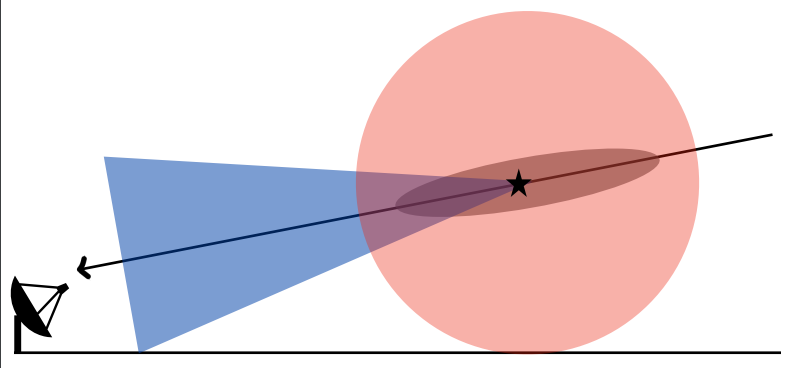

# EASpy 
<a rel="license" href="http://creativecommons.org/licenses/by-sa/4.0/"></a><br />This work is licensed under a <a rel="license" href="http://creativecommons.org/licenses/by-sa/4.0/">Creative Commons Attribution-ShareAlike 4.0 International License</a>.
   
Simulation of extenden air showers at large zenith angles based on parametrizations
for electron-positron distributions and its consequent emission of fluorescence and Cherenkov
light in a analytical way while taking into account the curvature of Earth’s atmosphere.   
See also: https://arxiv.org/abs/2305.08710   


# Install
In order to use the build script you need an Anaconda installation 
```
./build.sh   
conda activate EASpy
```
# Example
In order to run the example in example.ipynb you must first execute get_example_data.sh
```
cd example/example_data
./get_example_data.sh
```
